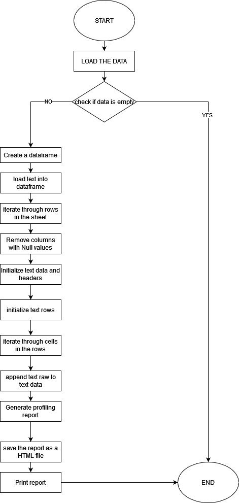

# Software Development Plan

## Project title

| no. | name | data | remark |
|:---|:---:|:---:|---:|
| 001| gee | 01.01 | good |

- pandas
- numpy
- mat

* good
* come
* see

tasklist
- [x] complete
- [ ] incomplet

1. Preparation

  ## 1.1. Scope

     1.1.1. Short Description

    Project Name: Offer design dashboard generator

Purpose: Develop a Python script to automate data profiling and report generation from Excel workbooks, providing insights 
into offer 

### 1.2. Project Plan

#### 1.2.1. Team
- Artiom 
     - George

#### 1.2.2. Functions & Roles

 Artiom (Supervisor)
  - Provide overall project guidance and direction.
  - Ensure that project goals align with the requirements.
  - Collaborate with George to define the specific requirements for data profiling and reporting.
  - Clarify any uncertainties and ensure a clear understanding of project objectives.
  - Monitor the project's progress and adherence to timelines.
  - Review and approve key project milestones and deliverables.
  - Provide feedback on George's work
  - Offer mentorship and guidance on best practices.

George (Developer)
   - Develop Python scripts for automating data profiling.
   - Load data from Excel workbooks and implement data analysis routines.
   - Create Python scripts to generate insightful HTML reports.
   - Ensure that reports include statistics, correlations, and missing value analysis.
   - Conduct thorough testing of the developed scripts to identify and rectify any issues.
   - Ensure that reports are accurate and well-structured.
   - Maintain project documentation, including code comments and documentation on report generation.
   - Regularly update Artiom on project progress, challenges, and achievements.
   - Seek Artiom's guidance and assistance when needed.

1.2.3. Phases & Task Management

## Planning Phase:
 - Collaborate with AXIOM-XD team including Artiom for detailed requirements
    - Identify and assign roles and responsibilities to team members(Artiom and George).
    - Develop a detailed project plan that includes timelines, milestones, and deliverables.
    - Determine the programming languages, frameworks, and tools that will be used for development.
    - Establish a communication plan that outlines how team members will communicate with each other.
    - Host a kick-off meeting to introduce the project plan, objectives, and roles to the entire project team.

## Execution Phase:

Development of the Python Script:

- George starts writing the Python script responsible for automating the data profiling process.
    - He use the libraries and tools mentioned in the project plan, such as openpyxl for Excel file handling and pandas for
      data manipulation.
    - The script is designed to load data from each sheet of Excel workbooks and perform various data profiling tasks,
      including analyzing statistics, correlations, and missing values.

Data Loading and Processing:

- The script is programmed to iterate through each sheet of the Excel workbooks, extracting data and storing it in memory.
    - Data preprocessing techniques may be applied to clean and prepare the data for analysis.

Statistical Analysis:

 - The script calculates various statistical metrics to gain insights into the data. This may include measures like mean, 
      median, standard deviation, and more.
    - These statistics help in understanding the distribution and characteristics of the data.

Correlation Analysis:

 - The Python script performs correlation analysis to identify relationships between different variables in the data.
    - Correlation matrices or visualizations may be generated to visualize these relationships.

Handling Missing Values:
 - The script addresses missing data by identifying missing values and applying appropriate strategies, such as imputation 
       or removal of rows or columns with missing values.

Report Generation:

- Generation of detailed HTML reports.
    - The Python script uses tools like pandas_profiling to create    insightful reports that summarize the data profiling results.
    - These reports may include tables, charts, and visualizations to make it easy for end-users to understand the data.

Testing and Quality Assurance:

  - The team conducts thorough testing to ensure that the Python script functions correctly.
  - Testing includes unit testing, integration testing, and user acceptance testing (UAT) to verify that the script meets 
   the project requirements.

Feedback Integration:

  - Artiom, acting as the project supervisor, provides feedback and guidance to George.
    - Any required adjustments or improvements are made based on this feedback to enhance the quality of the script.

## Postprocessing Phase:

Deployment 
 - Google colabs

1.2.4. Timeline :    5 working days

1.2.5. Milestones : Day 1 & 2 : completion of data profiling script.
             Day 3 : Successfull generation of HTML report.
             Day 4 : Testing completed with at least 95% accuracy.
             Day 5 : Diployment to google colabs

1.2.6. Dependencies
- Pandas
      - openpyxl
      - pandas profiling
      - Excel worksheet

1.2.7. Resources
 - Development tools : Google colabs, Jupyter notebook, github
     - Data profiling tools : pandas, openpyxl
     Project management : Odoo

1.2.8. Budget
- Cash budget = 0 
     - Time budget = 40 hours
